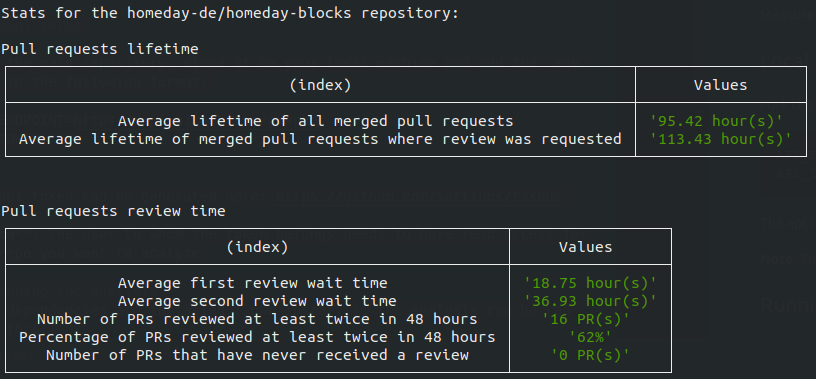
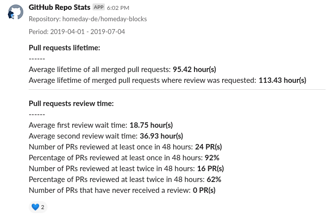
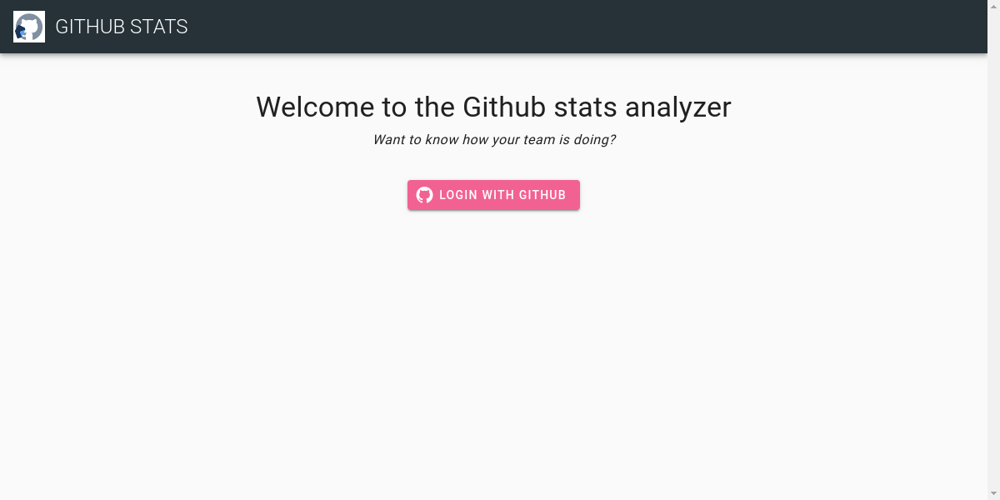
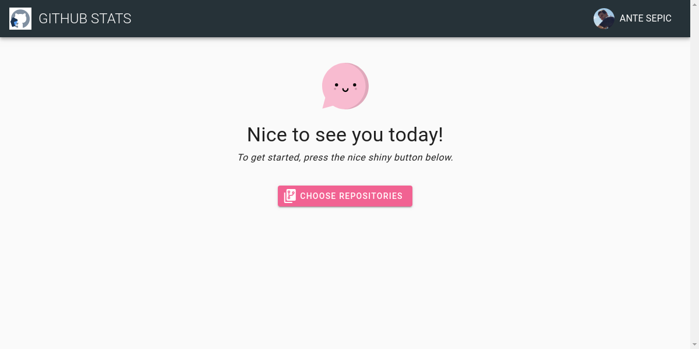
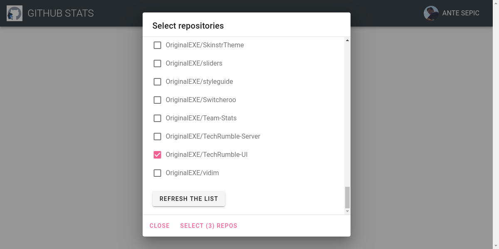
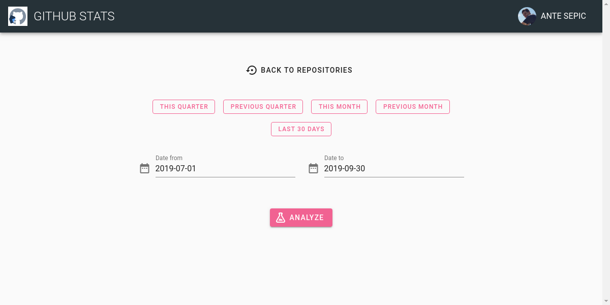
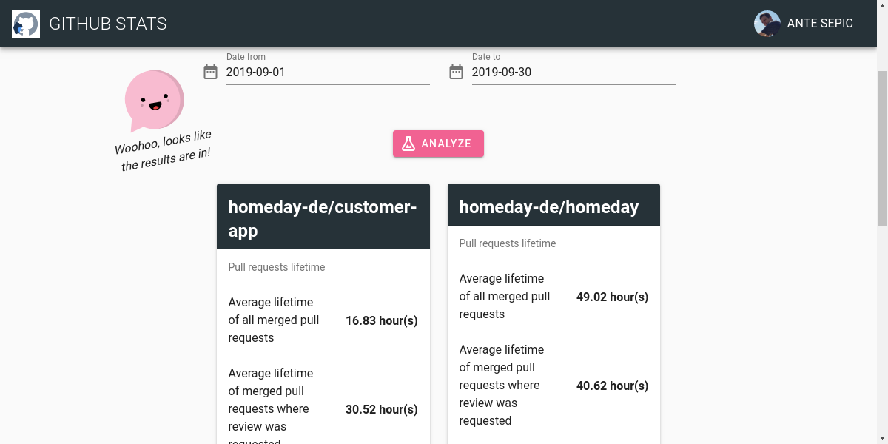

_On how we learned about ourselves and had fun in the process_

Earlier this year, we have set an interesting key result (as part of our OKRs) - Average waiting time for two pull request reviews should be under 48 hours. The benefits of timely pull request reviews were clear to us:

- not blocking your teammates (or yourself, if you depend on a feature inside the pull request)
- checking the code while its context is still fresh

We felt that 48 hours was a good balance between taking time to properly review the code and moving swiftly.

What wasn't clear for us was how we will measure it. We also did not know our current "timing", but it felt like in some cases, it was taking longer than ideal.

### Action plan

So we knew what we wanted, now was the time to figure out how to get it. After spending some time DuckDuckGo-ing, we were not able to find a tool that could help us. Luckily for us, we know how to code!

Thanks to the availability of a GraphQL GitHub API, fetching the necessary data was fairly straightforward. Afterward, it was just a matter of doing some calculations and we had our first stats. I built the tool in JavaScript (Node.js), and the first version had to be run via command line.

 _First version displayed the results directly in the terminal_

This was very exciting, we could finally measure the times it takes us to review pull requests, among other things. But the output was not super friendly. I decided to give posting to Slack a chance. They make the process easy, you post a JSON to the webhook and it auto-posts to any channel for you. We now had the stats in Slack.

 _Displaying the results in a Slack channel_

Slack message looked much better than the terminal output we had previously, but it was taking quite a bit of space. Once we ran the analysis for multiple repositories, it felt kinda spam-y.

We needed a better solution.

### If only we knew some frontend people

Oh, wait.

Here at Homeday, every quarter we have something called Product Engineering Week (PEW for short). It's a time where we have no meetings and each member of the product team gets to work on projects that we would not tackle in normal sprints. I decided to work on a UI that would communicate with the backend script we already had and _beautifully_ display the results.

I did decide on some rules (which later proved challenging):

For the backend, I wanted to use AWS Lambdas (I chose AWS since we already use AWS ecosystem for our whole infrastructure, it just made sense.)

Instead of this being an app only for Homeday (with perhaps a predefined list of repositories and a GitHub token stored somewhere on the backend,) I decided to integrate GitHub authentication so that anyone with an account could use the tool.

### AWS Lambdas

I already had some previous adventures in the serverless world, but by no means would I call myself experienced with the technology. I chose [Serverless](https://serverless.com/) because it makes it much easier to get started and develop your Lambdas (and serverless functions from many other providers), with a fairly quick feedback loop between making changes locally and them being reflected on Amazon servers.

It took some time to get it right, but the first version went quite smoothly. I migrated the previous Node.js code into a Lambda and through Serverless config file connected it to the API gateway so I could simply send some GET requests and get the results back.

### Frontend

Now that the backend was ready, it was time to do what I wanted in the first place - provide a nice interface for interacting with the analysis tool. I had limited time so I chose [Vuetify](https://vuetifyjs.com/en/) as a base for my interface. We have very recently open-sourced our own components library "[Homeday Blocks](https://blocks.homeday.dev)", but it's still missing some layout components that I wanted in my interface. It was also a nice opportunity to get to know the highly praised Vuetify and learn from it for our library.

There are three parts to the flow:

- Authenticating with a GitHub account (for this I used [Auth0](https://auth0.com/) which made it fairly painless)
- Providing the list of repositories that can be analyzed and also getting the date range
- Displaying the results

Here are some images showing what it looks like:

 _Login screen_

 _Welcome screen_

 _Selecting repositories_

 _Selecting the date range_

 _Displaying the results_

I added some sugar on top like adding buttons for a quick selection of most often used date ranges and [Vue Kawaii](https://vue-kawaii.now.sh/) to make the app a bit more friendly. Everything was fine and dandy in my universe, but then everything changed...

### The Murphy awakens

Luckily, no fire nation attacked me. It was AWS! The issue happened when I tried to run the analysis tool on one of our more active repositories. It kept timing out!

Uh oh...

> "I'll simply increase the Lambda timeout" - an innocent child

It made no difference, my Lambda was still timing out after exactly 29 seconds. Three and a half DuckDuckGo-s later, and I found out that it's a hard limit imposed by AWS for any Lambda triggered by the API gateway.  Sh\*t.

### Return of the Jedi

It did not help that it was already Thursday and our PEW finishes on Friday. I had about 6 more work hours left before our "demo ceremony" and had to come up with a solution. Of course, I could have just picked some simpler repositories for the demo, and that was indeed my plan B. Luckily, I never had to use it.

I decided to go with what I dubbed "The two Lambdas approach (Temporary Name)" ®.

I implemented one Lambda that took a request, generated a unique identifier and replied with it. It also kicked off the second Lambda (and thus avoiding the hard limit) which did the calculation and stored it to an S3 instance as a JSON file (using the unique identifier we sent to the frontend as its name).

On the frontend, after receiving the response, the code polls every 5 seconds for the expected file on S3, and once it finds it, displays the results.

It's a hacky/dirty/whatever approach but it works, for the scale we expect, it should not crash AWS.

### Summary

The app is live and kicking. You can try the hosted version here: [Homeday GitHub Stats](https://github-stats.homeday.dev/)

You can also find the code (and contribute to it) at the following links:
Backend: [https://github.com/homeday-de/homeday-github-stats-backend](https://github.com/homeday-de/homeday-github-stats-backend)
Frontend: [https://github.com/homeday-de/homeday-github-stats-frontend](https://github.com/homeday-de/homeday-github-stats-frontend)

All feedback is welcome (especially Lambda shaming).

Finally, if you want a chance to work on cool projects like these, [Homeday is hiring](https://grnh.se/65174d7f2). Come to Berlin and take part in our next PEW!
